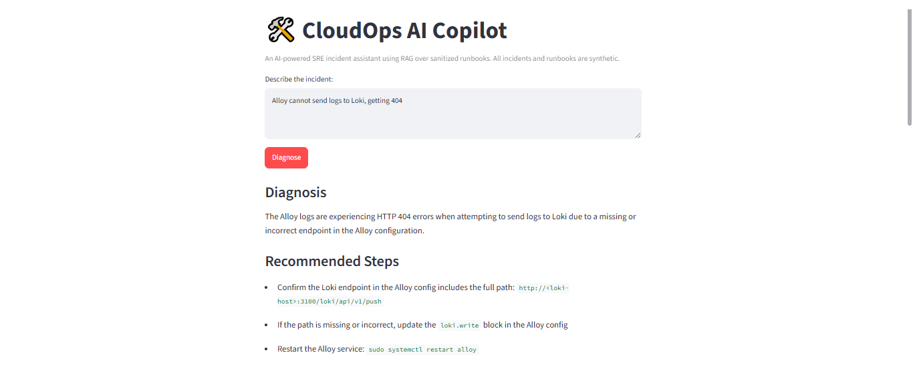
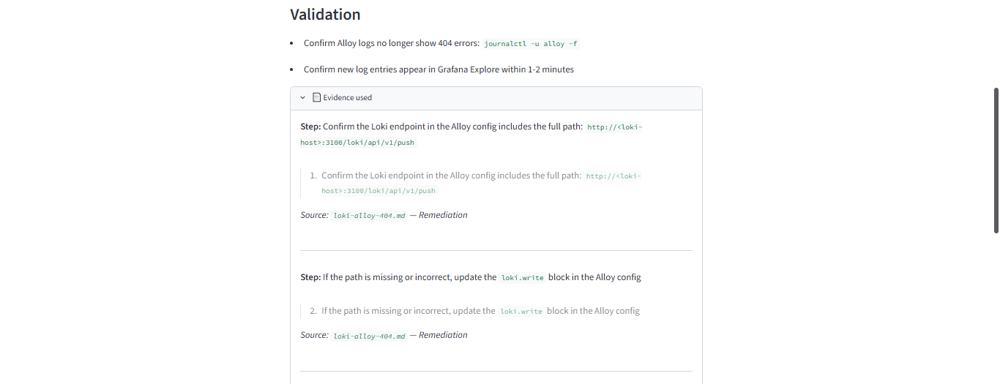
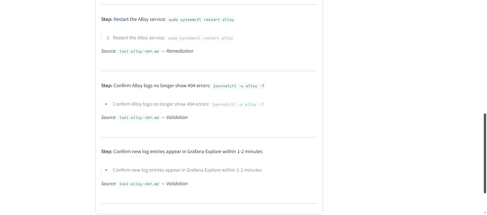
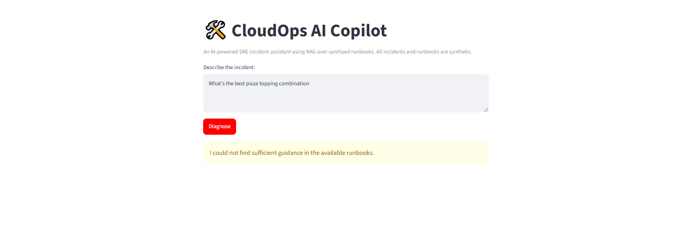

# CloudOps AI Copilot

An AI-powered SRE incident assistant that uses Retrieval-Augmented Generation to diagnose infrastructure incidents against operational runbooks. Remediation and validation steps are rendered directly from source text rather than generated or paraphrased by the model.

This is a focused prototype/MVP, not a production incident-management platform. It demonstrates RAG architecture, local LLM deployment, and a deliberately conservative approach to grounding: the LLM writes only a short diagnosis, while all actionable steps are extracted deterministically in Python.




## Table of Contents

1. [Problem Being Solved](#problem-being-solved)
2. [Architecture](#architecture)
3. [AI / RAG Workflow](#ai--rag-workflow)
4. [Technologies Used](#technologies-used)
5. [Security Decisions](#security-decisions)
6. [Installation Instructions](#installation-instructions)
7. [Example Input and Output](#example-input-and-output)
8. [How It's Grounded](#how-its-grounded)
9. [Unsupported Query Handling](#unsupported-query-handling)
10. [Automated Tests](#automated-tests)
11. [Evaluation Results](#evaluation-results)
12. [Known Limitations](#known-limitations)
13. [Docker Status](#docker-status)
14. [Future Improvements](#future-improvements)
15. [Cost-Conscious Cleanup Instructions](#cost-conscious-cleanup-instructions)
16. [Synthetic Data Statement](#synthetic-data-statement)
17. [License](#license)


## Problem Being Solved

SRE and DevOps teams rely on runbooks to diagnose recurring infrastructure incidents, but manually searching documentation during an active incident is slow. This project explores whether a small, locally-run LLM combined with a RAG pipeline can:

- Retrieve the correct runbook for a described incident
- Present remediation and validation steps extracted directly from the selected runbook, preventing the LLM from paraphrasing, omitting or fabricating actionable instructions.
- Generate a short, safety-checked diagnosis explaining the likely cause
- Safely decline to answer when no runbook covers the incident

The scenarios modeled here (Grafana Alloy → Loki log shipping failures, Kubernetes pod crash loops, suspicious network traffic) are inspired by real production troubleshooting patterns.

I had seen how much time engineers can spend locating the correct troubleshooting steps during incidents, so I built a small RAG assistant that retrieves the relevant runbook and reliably surfaces its approved steps.


## Architecture

```
Markdown runbooks
       ↓
LangChain document loader (DirectoryLoader + TextLoader)
       ↓
LangChain text splitter (RecursiveCharacterTextSplitter)
       ↓
Ollama embeddings (nomic-embed-text)
       ↓
ChromaDB vector store
       ↓
User incident → similarity search with relevance scoring
       ↓
Retrieval-score gating (deterministic threshold)
       ↓
Best-matching runbook identified → full file loaded from disk
       ↓
Python deterministically extracts all Remediation + Validation lines
       ↓
Ollama LLM (qwen2.5:1.5b-instruct) generates ONLY a short diagnosis
       ↓
Safety check replaces the diagnosis with a generic fallback if a command or URL is detected
       ↓
Diagnosis + exact runbook steps + citations, displayed in Streamlit
```

**Key design principle, evolved through testing:** earlier versions asked the LLM to both select relevant runbook lines *and* to generate its own instruction text for each step. Testing showed two failure modes from this: the model sometimes selected a *technically real* but *semantically mismatched* line as "evidence" for a step (e.g., citing a Symptom line to justify a Remediation action), and even when evidence-matching worked, the specific *subset* of steps the model chose to include varied between otherwise-identical runs. 

The final architecture removes the model from both decisions: Python deterministically extracts every Remediation and Validation line from the identified runbook, in order, every time. The LLM's only remaining job is a short diagnosis, which is itself checked and rewritten if it contains a command or URL.


## AI / RAG Workflow

1. **Chunking (for retrieval only):** Runbooks are split into overlapping chunks (500 chars, 50 overlap) and embedded with `nomic-embed-text` for semantic search.
2. **Retrieval:** The incident description is embedded and compared against stored chunks by cosine similarity. Results below a relevance threshold (0.55) are rejected outright — this is the sole gate for "is this incident covered by our runbooks," and it is fully deterministic.
3. **Full-file extraction:** Once the best-matching runbook is identified from retrieval, the *entire* file is read from disk and parsed line-by-line, tagging each line with its markdown section (Symptoms, Likely Causes, Remediation, Validation). This avoids missing steps that could occur if only the top-k semantically retrieved chunks were used.
4. **Deterministic step extraction:** Every line under `## Remediation` and `## Validation` is extracted directly into the response — the LLM never sees or influences this step.
5. **Diagnosis generation:** The LLM is prompted only to write a 1-2 sentence diagnosis of the likely cause, explicitly instructed not to include commands or procedural steps.
6. **Diagnosis safety check:** The generated diagnosis is scanned for command markers (`sudo `, `kubectl `, `http://`, etc.); if any are found, the diagnosis is replaced with a safe generic fallback sentence rather than displayed as-is.


## Technologies Used

| Component | Tool |
|---|---|
| Orchestration | LangChain (basic pipeline only — no LangGraph, no agents) |
| Vector store | ChromaDB |
| Embedding model | Ollama — `nomic-embed-text` |
| Chat model | Ollama — `qwen2.5:1.5b-instruct` (diagnosis only) |
| Structured output | Pydantic + LangChain's `with_structured_output` |
| Interface | Streamlit |
| Testing | pytest |
| Language | Python 3.12 |
| Environment | WSL2 (Ubuntu) |


## Security Decisions

- **No real infrastructure data:** all runbooks and sample incidents are synthetic or generalized — no real hostnames, IPs, credentials, or company-specific details.
- **No agentic or autonomous actions:** the system only diagnoses and displays runbook guidance — it never executes commands or modifies infrastructure.
- **Steps are never model-generated:** remediation and validation instructions are extracted verbatim from the source runbook by Python, eliminating the risk of the model inventing or altering a command.
- **Diagnosis is scoped and checked:** the LLM is explicitly restricted to a short diagnosis, and that output is scanned for command-like content before display.
- **No secrets in the repository:** no API keys, credentials, or `.env` files are committed (see `.gitignore` and `.env.example`).


## Installation Instructions

### Prerequisites
- Python 3.10+
- [Ollama](https://ollama.com/download) installed locally

### Setup

```bash
git clone https://github.com/LydiahLaw/cloudops-ai-copilot.git
cd cloudops-ai-copilot

# Pull required models
ollama pull qwen2.5:1.5b-instruct
ollama pull nomic-embed-text

# Set up Python environment
python3 -m venv venv
source venv/bin/activate  # On Windows: venv\Scripts\activate

# Install dependencies
pip install -r requirements.txt

# Run the tests
pytest tests/ -v

# Run the app
streamlit run app/streamlit_app.py
```

The app opens at `http://localhost:8501`.


## Example Input and Output

**Input:**
```
Alloy cannot send logs to Loki, getting 404
```

**Output:**

> **Diagnosis:** The Alloy logs are experiencing HTTP 404 errors when attempting to send logs to Loki due to a missing or incorrect endpoint in the Alloy configuration.
>
> **Recommended Steps:**
> - Confirm the Loki endpoint in the Alloy config includes the full path: `http://<loki-host>:3100/loki/api/v1/push`
> - If the path is missing or incorrect, update the `loki.write` block in the Alloy config
> - Restart the Alloy service: `sudo systemctl restart alloy`
>
> **Validation:**
> - Confirm Alloy logs no longer show 404 errors: `journalctl -u alloy -f`
> - Confirm new log entries appear in Grafana Explore within 1-2 minutes

*(See screenshot above.)*


## How It's Grounded

Every displayed step is extracted directly from the runbook, and its evidence panel shows the exact source line and section it came from — the instruction text and the evidence text are always identical, by construction.






## Unsupported Query Handling

**Input:**
```
What's the best pizza topping combination
```

**Output:**
```
I could not find sufficient guidance in the available runbooks.
```

No diagnosis, no steps, and no sources are shown — the relevance gate rejects the query before any runbook is loaded or any generation is attempted.




## Automated Tests

14 tests total, none of which require Ollama to be running (all runtime in under 5 seconds):

| Test file | Test | Result |
|---|---|---|
| `test_rag.py` | Runbooks load successfully | ✅ Pass |
| `test_rag.py` | Loki incident retrieves Loki runbook | ✅ Pass |
| `test_rag.py` | Kubernetes incident retrieves CrashLoopBackOff runbook | ✅ Pass |
| `test_rag.py` | Network incident retrieves security runbook | ✅ Pass |
| `test_rag.py` | Unsupported question is rejected | ✅ Pass |
| `test_rag.py` | Rephrased incident retrieves correct runbook | ✅ Pass |
| `test_validation.py` | Symptoms lines are excluded from remediation | ✅ Pass |
| `test_validation.py` | Remediation steps are extracted correctly | ✅ Pass |
| `test_validation.py` | Validation steps are extracted separately from remediation | ✅ Pass |
| `test_validation.py` | Displayed instruction always matches its evidence text exactly | ✅ Pass |
| `test_validation.py` | Diagnosis containing a command is flagged | ✅ Pass |
| `test_validation.py` | Clean diagnosis is not flagged | ✅ Pass |
| `test_validation.py` | Markdown bullets/numbers are stripped from displayed steps | ✅ Pass |
| `test_validation.py` | Section name variants normalize correctly | ✅ Pass |

**Result: 14/14 tests passed** (Python 3.12, pytest).

Run with:
```bash
pytest tests/ -v
```


## Evaluation Results

Retrieval selected the expected runbook for every query in this hand-built evaluation set, using a relevance threshold of 0.55:

| Query | Expected Result | Retrieved Result | Score | Outcome |
|---|---|---|---|---|
| Alloy cannot send logs to Loki, getting 404 | Loki runbook | Loki runbook | 0.848 | Pass |
| Grafana Alloy logs show HTTP 404 when pushing to Loki (rephrased) | Loki runbook | Loki runbook | 0.85+ | Pass |
| Pod keeps restarting with CrashLoopBackOff | Kubernetes runbook | Kubernetes runbook | 0.725 | Pass |
| Seeing repeated failed SSH login attempts from one IP | Network runbook | Network runbook | 0.618 | Pass |
| I am seeing repeated failed SSH login attempts from one IP address (rephrased) | Network runbook | Network runbook | 0.593 | Pass |
| My Loki instance is returning a timeout instead of a 404 | No match expected (different problem) | No match | below 0.55 | Pass |
| What's the best pizza topping combination | Reject | Rejected | below 0.55 | Pass |

Because remediation and validation steps are now extracted deterministically once the correct runbook is identified — rather than selected by the LLM — the *content* of the response (which steps appear, and in what order) is identical on every run for a given query. Only the short diagnosis sentence varies in wording between runs; the actionable content does not.

This is a small, hand-built evaluation set seven queries across three runbooks; sufficient to demonstrate the retrieval and extraction mechanism. It is not a claim of production-scale accuracy. See [Future Improvements](#future-improvements) for planned expansion.


## Known Limitations

This project went through several real architectural iterations, documented honestly because the *process* of finding and fixing each issue is as informative as the final design:

1. **Model selection mattered significantly.** The initial model, `llama3.2:1b`, both fabricated plausible-but-nonexistent commands and later began refusing to answer entirely once the prompt included incident-response framing — likely misapplied safety guardrails on benign defensive SRE content. Switching to `qwen2.5:1.5b-instruct` resolved both issues.

2. **Letting the LLM select which evidence supported a step was not reliable enough**, even with structured output and exact-ID matching. Testing surfaced two distinct problems: the model could pair a real, existing runbook line with the wrong step (e.g., citing a Symptom as evidence for a Remediation action), and the specific subset of valid steps it chose to include varied between identical repeated runs — one run correctly included "Restart Alloy," the next omitted it. Both problems were solved by removing step-selection from the LLM's responsibilities entirely: Python now deterministically extracts every Remediation and Validation line from the correct runbook, and the LLM is only asked for a short diagnosis.

3. **The retrieval relevance threshold required empirical tuning.** At 0.60, a rephrased but valid SSH query scored 0.593 and incorrectly fell back to "no guidance found." Lowering the threshold to 0.55 fixed this without causing the unrelated pizza question to incorrectly pass — see the scores in the [Evaluation Results](#evaluation-results) table.

4. **A validation bypass was found and fixed:** an earlier design correctly rejected unvalidated remediation *steps*, but the free-text diagnosis field could still contain the same unvalidated instructions, defeating the purpose of the validation layer. The final design explicitly scans the diagnosis for command markers and replaces it with a safe generic sentence if any are found.

5. **This is a 3-runbook, 7-query evaluation set.** It is sufficient to demonstrate the mechanism (ingestion, chunking, embeddings, retrieval, relevance gating, deterministic extraction, unsupported-query rejection) but is not a production-scale accuracy claim.


## Docker Status

An experimental `Dockerfile` is included in this repository but **has not yet been validated end-to-end**. Local WSL2 execution (per the Installation Instructions above) is the currently supported and tested setup.

Before the Docker path can be considered supported, the following need verification: how the container reaches Ollama on the host (`host.docker.internal` vs. a configurable `OLLAMA_BASE_URL`), whether Chroma persistence is mounted as a volume, and whether the container correctly exposes port 8501 with Streamlit bound to `0.0.0.0`. This is tracked as a near-term follow-up.


## Future Improvements

- Validate the included `Dockerfile` end-to-end, including Ollama host connectivity
- Expand the evaluation set beyond the current 7 queries across 3 runbooks, including ambiguous and adversarial cases
- Add environment-variable configuration for the model names and relevance threshold, rather than hardcoded values
- Add a helpful error message if Ollama is unreachable or a required model hasn't been pulled
- Evaluate a mid-sized model (7B class) to assess whether diagnosis quality improves, hardware permitting


## Cost-Conscious Cleanup Instructions

This project runs entirely locally with no cloud costs incurred:

- All models run via Ollama on local hardware — no API usage fees
- To remove local resources: `ollama rm qwen2.5:1.5b-instruct nomic-embed-text` and delete the `chroma_db/` directory


## Synthetic Data Statement

All runbooks, incident descriptions, and test queries used in this project are synthetic or generalized from publicly known troubleshooting patterns. No real production logs, IP addresses, hostnames, credentials, or company-specific infrastructure details appear anywhere in this repository.


## License

MIT License - see `LICENSE` file.